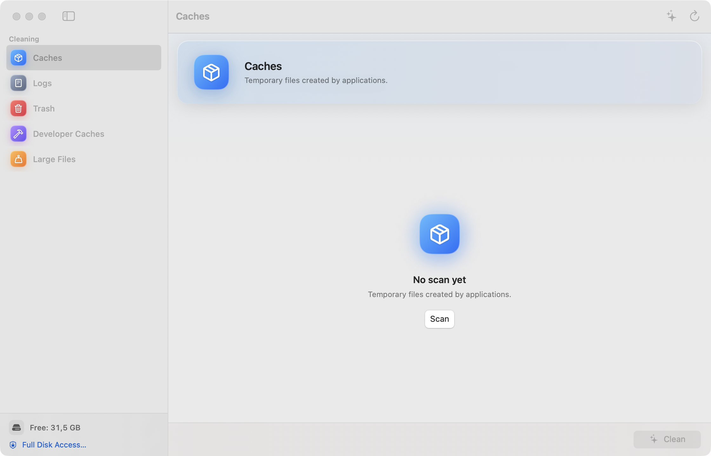
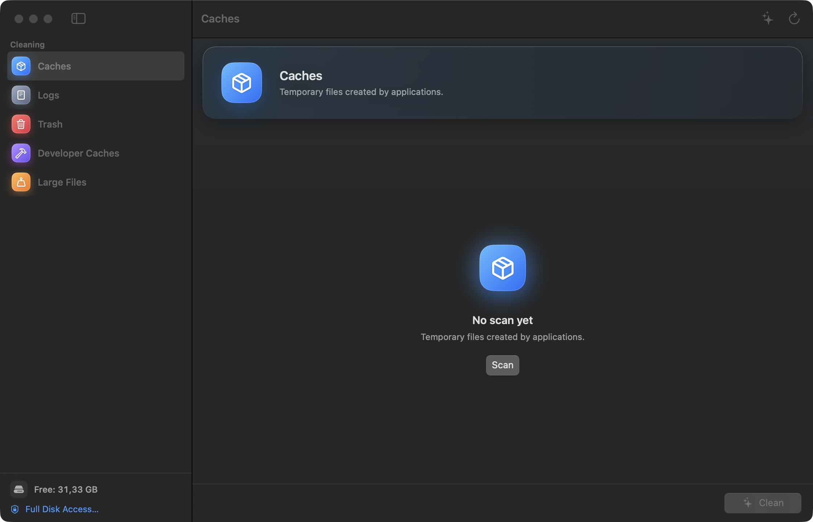

# Sweep

**English** | [Français](README.fr.md)

Sweep is a native macOS disk cleaner. It scans caches, logs, the Trash,
developer caches, and large files, then moves what you select to the Trash.
There is no permanent deletion except the one action you explicitly confirm:
emptying the Trash.

Built with SwiftUI and Swift Package Manager, macOS 14+, no third-party
dependency, no telemetry, no networking.

[](https://github.com/DavidMolinari/sweep/actions/workflows/ci.yml)
[](LICENSE)


## Screenshots

| Light | Dark |
| --- | --- |
|  |  |

## Features

- **Caches** — contents of `~/Library/Caches`, measured with allocated blocks
  (real disk usage, not logical size).
- **Logs** — contents of `~/Library/Logs`.
- **Trash** — contents of `~/.Trash`. Cleaning this category is the only
  permanent deletion in the app.
- **Developer caches** — Xcode DerivedData and DeviceSupport, CoreSimulator,
  Homebrew, CocoaPods, SwiftPM, pip, npm/yarn/pnpm, Gradle, Cargo, Go, and
  Hugging Face caches.
- **Large files** — scans Downloads, Desktop, Documents, Movies, Pictures, and
  Music, or a folder you pick. Configurable size threshold, optional
  "older than 6 months" filter, sorted by descending size. Project subtrees and
  sensitive packages are excluded from the scan, so they are never proposed.
- **Safety flags** — archives, disk images, databases, running applications,
  debug symbols, and AI models are flagged and unchecked by default. Large
  files are always unchecked by default: nothing is removed without an explicit
  per-row choice.

## Requirements

- macOS 14 (Sonoma) or later
- Xcode 15 or later to build from source (Swift 5.9 toolchain)

## Build and run

```sh
git clone https://github.com/DavidMolinari/sweep.git
cd sweep
make run
```

`make run` builds the release binary, assembles `dist/Sweep.app`, signs it
ad-hoc, and opens it. To build the bundle without launching it:

```sh
make app
```

### Make targets

| Target | Effect |
| --- | --- |
| `make build` | Build the release binary with SwiftPM |
| `make app` | Assemble and ad-hoc sign `dist/Sweep.app` |
| `make run` | `make app` then open the app |
| `make install` | Copy the app to `/Applications` |
| `make release` | Build a zip of the app plus a SHA-256 checksum in `dist/` |
| `make clean` | Remove build products and `dist/` |

### Install

```sh
make install
```

The bundle is copied to `/Applications/Sweep.app`. If `/Applications` is not
writable by your user, the command stops and tells you to re-run it with
`sudo`. Releases are signed ad-hoc, not notarized: a downloaded copy may need
a right-click → **Open** the first time, or `xattr -d com.apple.quarantine`.

## Safety model

Sweep is designed so that the worst case is a file sitting in the Trash.

### Never proposed for deletion

- **Project subtrees.** During large-file scans, a folder containing a project
  marker (`.git`, `package.json`, `Cargo.toml`, `go.mod`, `pyproject.toml`,
  `Package.swift`, `pom.xml`, `*.xcodeproj`, `*.xcworkspace`, `CMakeLists.txt`,
  `Dockerfile`, …) is not traversed.
- **Sensitive packages and containers.** `.app`, `.framework`, `.bundle`,
  `.plugin`, `.kext`, photo libraries (`*.photoslibrary`, …), iMovie/TV and
  Final Cut libraries, and virtual disks and VMs (`.sparsebundle`,
  `.sparseimage`, `.vmwarevm`, `.utm`, `.qcow2`, `.vmdk`, …) are skipped.
- **Protected locations.** The cleaner refuses `/`, `~`, `~/Library`,
  `~/Documents`, `~/Desktop`, `~/Downloads`, `/Applications`, `/System`,
  `/Library`, `/private`, `/usr`, `/bin`, … and sensitive subtrees such as
  `~/Library/Containers`, `Application Support`, `Mail`, `Safari`, `Keychains`,
  and `CloudStorage`.
- **Symlinks.** They are never followed, at scan time or clean time.
- **Custom scan roots.** Choosing `~/Library`, `~/.Trash`, `/Applications`,
  `/System`, … as the large-file root is rejected with an alert, and those
  areas are never traversed even if a path led there.

Each scanned item carries its scan root. The cleaner refuses any item that is
not a strict descendant of that root, even after resolving symlinks, and
refuses items flagged as protected even if the UI somehow presented them. The
deletion mode is decided in code by the category, never by the UI.

### Moved to the Trash (recoverable)

Caches, logs, developer caches, and large files are moved with
`FileManager.trashItem`. On APFS the move is instant; the space is reclaimed
when you empty the Trash, or later from the app's **Trash** category.

### The only permanent action

Emptying the Trash. It is restricted to the Trash category, announced as
irreversible in the confirmation sheet, and only paths inside `~/.Trash` can be
removed. Nothing else in the app deletes permanently.

### Automated guards

```sh
./dist/Sweep.app/Contents/MacOS/Sweep --selftest
```

Four checks run against temporary fixtures and clean up after themselves:

```
move-to-trash:      removed=1 failures=0 gone=true
outside-root:       removed=0 failures=1 intact=true
trash-outside:      removed=0 failures=1 intact=true
empty-trash:        removed=1 failures=0 gone=true permanent=true
```

Exit code is 0 only when all four pass. CI runs this on every push.

## Full Disk Access

Sweep works without it. Granting Full Disk Access widens the readable scope of
the scan, which is useful to see caches and logs protected by TCC (Mail,
Safari, other apps):

1. System Settings → Privacy & Security → **Full Disk Access**.
2. Add `dist/Sweep.app` (or `/Applications/Sweep.app`).

Because local builds are signed ad-hoc rather than with a Developer ID, macOS
may ask again after `make app` replaces the binary.

## Localization

The interface is localized with `Support/Resources/*.lproj/Localizable.strings`
(keys in English): **English** (base), **French**, **German**, and **Spanish**.
The app follows the system language; to force a language for one app use
System Settings → General → Language & Region → Applications.

To add a language: duplicate `Support/Resources/en.lproj`, keep the files in
sync, translate the values, add the language to `CFBundleLocalizations` in
`Support/Info.plist`, then run `make app`.

## Command line

The app bundle is also a small headless tool.

### `--scan`

```sh
./dist/Sweep.app/Contents/MacOS/Sweep --scan [category ...]
```

Categories: `caches`, `logs`, `trash`, `developer`, `largeFiles`. With no
category, all of them are scanned. Output is one tab-separated summary line per
category, followed by the first 12 items with their safety tag:

```
caches	~/Library/Caches	42 items	123456789 bytes	1.8s
   [safe] selected=true 10485760	/Users/me/Library/Caches/example
   [caution:app-running] selected=false 5242880	/Users/me/Library/Caches/other
```

Exit code is 0 on success, 1 for an unknown category name. The scan is
read-only: `--scan` never deletes or moves anything.

### `--selftest`

Runs the four guardrail tests described above and exits 0 (pass) or 1 (fail).
Useful before and after a release build, and in CI.

## Project layout

```
Sources/Sweep/
  SweepApp.swift          SwiftUI entry point, menu commands
  HeadlessMode.swift      --scan and --selftest
  Models/                 categories, scan items, safety levels, AppModel
  Services/               DiskScanner (read), Cleaner (trash / empty)
  Views/                  sidebar, category detail, confirmation and report
Support/
  Info.plist              bundle metadata (localizations, usage descriptions)
  Resources/*.lproj/      en, fr, de, es strings
  Branding/               app icon (AppIcon.icns), optional at build time
Makefile                  build, bundle, install, release
docs/                     releasing guide and screenshots
```

## Contributing

See [CONTRIBUTING.md](CONTRIBUTING.md), the
[Code of Conduct](CODE_OF_CONDUCT.md), and [SECURITY.md](SECURITY.md) for
private vulnerability reports. The safety invariants listed in CONTRIBUTING are
required reading before touching `Services/`.

## License

[MIT](LICENSE) © 2026 David Molinari.

Sweep has no third-party dependency: it uses only Apple frameworks (SwiftUI,
AppKit, Foundation) and SF Symbols referenced by name. See
[THIRD_PARTY_LICENSES.md](THIRD_PARTY_LICENSES.md) for details.
